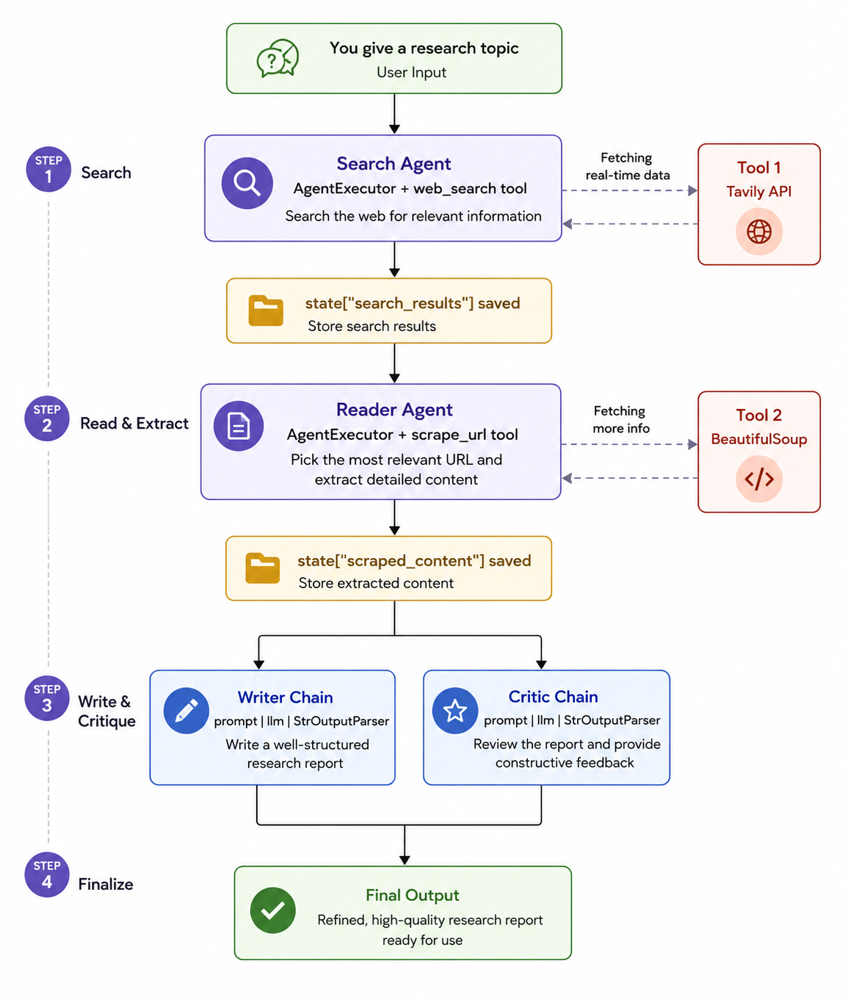

# 🔬 Research Agent — Multi-Agent Research System

A fully autonomous multi-agent research pipeline that takes any topic, searches the web, scrapes top sources, writes a structured report, and critiques it — all in one run. Built with LangChain, MistralAI, and a sleek Streamlit UI.

---



## 🧠 How It Works

The pipeline runs 4 agents/chains in sequence, each passing its output to the next:

```
Topic Input
    │
    ▼
[1] Search Agent      →  Searches the web via Tavily API
    │
    ▼
[2] Reader Agent      →  Scrapes the top URL with BeautifulSoup
    │
    ▼
[3] Writer Chain      →  Writes a full structured report (LCEL)
    │
    ▼
[4] Critic Chain      →  Reviews & scores the report (LCEL)
    │
    ▼
Final Report + Feedback + JSON Download
```

---

## 📁 Project Structure

```
.
├── agents.py       # Defines all 4 agents & chains
├── pipeline.py     # Supervisor — runs the full pipeline
├── tools.py        # Custom LangChain tools (web search + scraper)
├── app.py          # Streamlit UI
├── .env            # API keys (not committed)
└── README.md
```

---

## ⚙️ Tech Stack

| Layer | Technology |
|---|---|
| LLM | MistralAI `ministral-8b-latest` |
| Agent Framework | LangChain (`create_react_agent` + `AgentExecutor`) |
| Chain Syntax | LangChain LCEL (`prompt \| llm \| StrOutputParser`) |
| Web Search | Tavily API |
| Web Scraping | BeautifulSoup4 + Requests |
| UI | Streamlit |
| Env Management | python-dotenv |
| Terminal Output | Rich |

---

## 🚀 Getting Started

### 1. Clone the repo

```bash
git clone https://github.com/your-username/research-agent.git
cd research-agent
```

### 2. Install dependencies

```bash
pip install langchain langchain-mistralai langchain-community
pip install tavily-python beautifulsoup4 requests
pip install streamlit python-dotenv rich langchainhub
```

### 3. Set up your `.env` file

```env
MISTRAL_API_KEY=your_mistral_api_key
TAVILY_API_KEY=your_tavily_api_key
```

### 4. Run in terminal

```bash
python pipeline.py
```

### 5. Run with Streamlit UI

```bash
streamlit run app.py
```

---

## 🔑 API Keys Required

- **MistralAI** — get yours at [console.mistral.ai](https://console.mistral.ai)
- **Tavily** — get yours at [tavily.com](https://tavily.com)

---

## 📄 Agent & Chain Details

### 1. Search Agent (`agents.py`)
- Uses `create_react_agent` + `AgentExecutor`
- Tool: `web_search` — queries Tavily and returns titles, URLs, and snippets (top 3 results)

### 2. Reader Agent (`agents.py`)
- Uses `create_react_agent` + `AgentExecutor`
- Tool: `scrape_url` — visits the most relevant URL and extracts clean readable text via BeautifulSoup

### 3. Writer Chain (`agents.py`)
- Pure LCEL: `writer_prompt | llm | StrOutputParser()`
- Produces a structured report: Introduction → Key Findings → Conclusion → Sources

### 4. Critic Chain (`agents.py`)
- Pure LCEL: `critic_prompt | llm | StrOutputParser()`
- Returns a score out of 10, strengths, areas to improve, and a one-line verdict

---

## 🖥️ Streamlit UI Features

- Live pipeline step cards (waiting → in-progress → done)
- Full report rendered in a clean reading block
- Critic score badge + detailed feedback
- Download the full pipeline state as JSON

---

## 📌 Notes

- The `scrape_url` tool extracts up to 3000 characters from the page to stay within token limits
- All agents use `temperature=0` for deterministic, factual outputs
- The pipeline state is a shared Python dictionary passed between all steps

---

